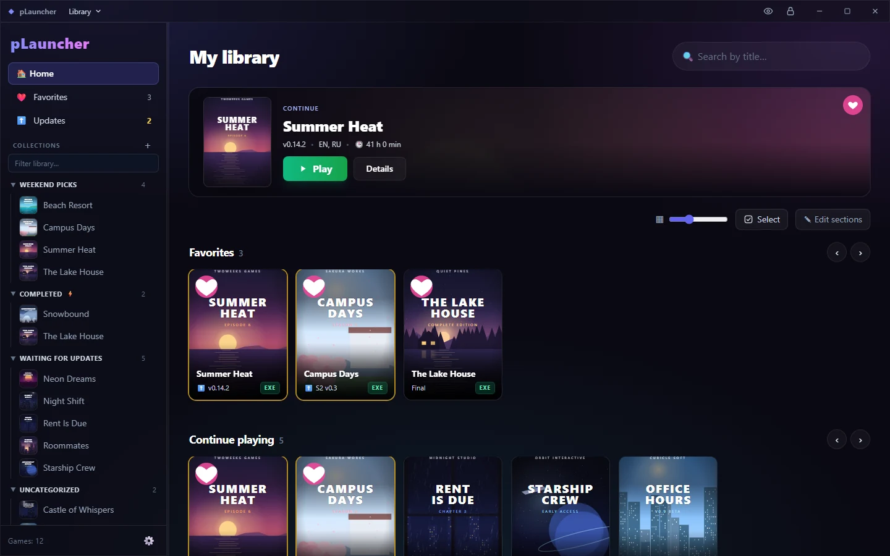
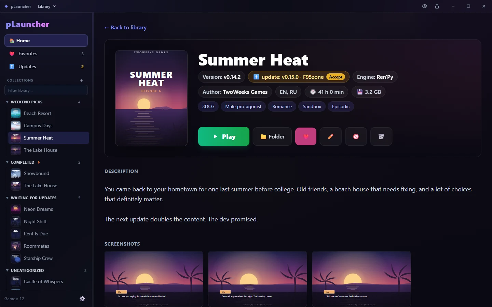
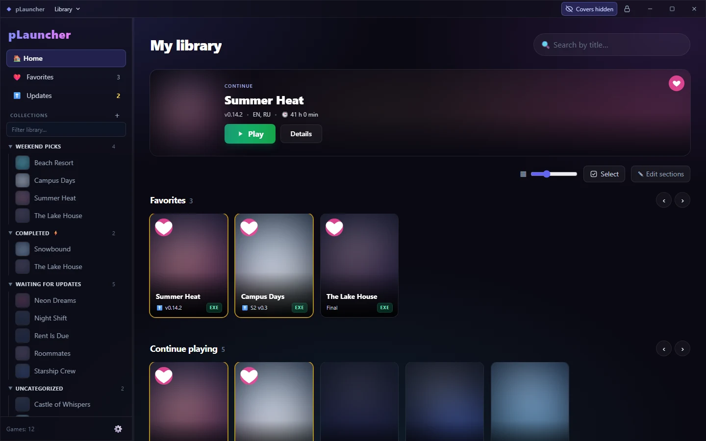
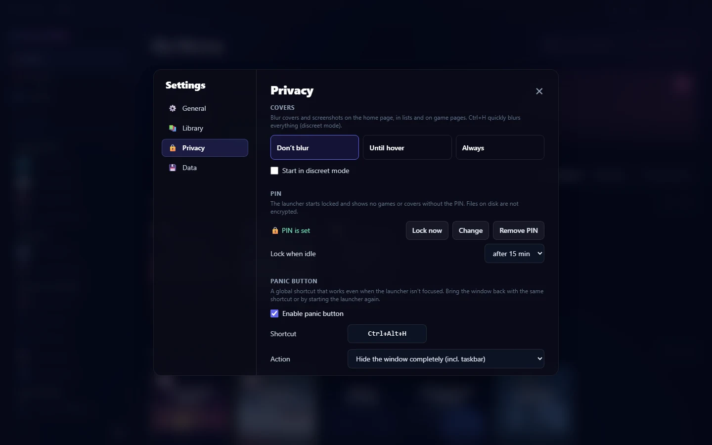
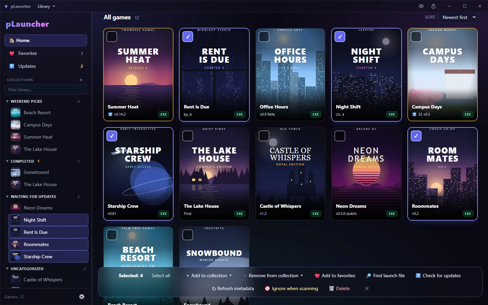

<p align="center">
  
</p>

<p align="center">
  <a href="https://github.com/BasteArima/pLauncher/releases/latest"></a>
  <a href="https://github.com/BasteArima/pLauncher/actions/workflows/ci.yml"></a>
  <a href="LICENSE"></a>
  
  
</p>

<p align="center">
  <b>A private, Steam-like launcher for your local game library.</b><br>
  Point it at your games folder: it finds every game, fills in covers and descriptions,<br>
  tracks playtime and tells you when a new version is out.
</p>

---

You downloaded *Summer Heat v0.14.2* three months ago. Is v0.15 out yet? Did you ever finish Episode 6?
Which of the forty folders called `Game` was it, anyway?

**pLauncher remembers, so you don't have to.** Everything stays on your machine: no accounts, no cloud,
no telemetry. And if someone walks in, one keypress hides it all.

<p align="center">
  
</p>

## Features

### 📚 Your library, finally in one place
- **Folder scanning.** Every subfolder becomes a game. The launch file is picked automatically, and it doesn't
  have to be an `.exe`: HTML, `.bat`, `.jar`, `.swf`, QSP, RAGS and LÖVE games work too (plus `.sh`, `.x86_64`,
  AppImage and `.app` on Linux and macOS).
- **Engine detection** by folder contents: Ren'Py, Unity, Unreal, Godot, RPG Maker, GameMaker, Construct, Wolf RPG,
  KiriKiri, TyranoBuilder, Flash, QSP and HTML.
- **Steam-style home:** a hero banner, shelves you can rearrange, collections (manual or by tags), favorites,
  search, sorting and adjustable card size.
- **Playtime tracking** and folder size on disk for every game.
- **Moved your games to another drive?** Missing folders are found and relinked, and your playtime,
  tags and collections stay put.
- Drag a folder onto the window to add it. Ignore folders that aren't games (hello, `_videos`).

### 🔎 Metadata from a link
Paste a game's page and pLauncher fills in the title, version, author, engine, languages, tags, description,
cover and up to 15 screenshots.

| Supported sites | |
|---|---|
| F95zone | Pornolab |
| Erotorrent | Island of Pleasure |
| Steam (official API) | *more are welcome, see [Contributing](#contributing)* |

<p align="center">
  
</p>

### ⬆️ Update tracking
Each game remembers where it came from. **Check all** compares the version you have with the latest one on each
source and marks the games that have a new build. Accept the update and the page is parsed again.
Your *Waiting for updates* collection has never been this easy to keep up with.

### 🙈 Privacy, taken seriously
- **Blur covers:** off, until hover, or always. `Ctrl+H` blurs everything instantly.
- **PIN lock:** the app starts locked and shows no games, covers or collections until you enter the PIN.
  It can also lock itself after a period of inactivity.
- **Panic button:** a global hotkey that hides the window, even when the launcher isn't focused (Windows).
- **Hidden collections:** games you don't want on the home screen, even in a private app.
- Your data folder lives wherever you choose. Covers and screenshots are plain local files: the PIN hides them
  in the app but doesn't encrypt them, so keep the folder somewhere private too.

<p align="center">
  
  
</p>

### ⚡ Built for big libraries
- **Bulk actions:** select with `Ctrl`/`Shift` + click and add to collections, favorite, refresh metadata,
  check for updates, find launch files or remove, all at once.
- **Keyboard-friendly:** arrows to move around, `Enter` to open, `Ctrl+Enter` to play, `F5` to scan,
  `Ctrl+F` to search, `F1` for the full list.
- **Backup and restore:** export your whole library (database, covers, custom languages) to a single `.zip`.
- **Self-update** on Windows and Linux, with SHA-256 verification.
- **11 languages:** English, Deutsch, Español, Français, Polski, Português (Brasil), Türkçe, Русский,
  Українська, 日本語, 简体中文. Add your own by dropping a JSON file into the data folder.

<p align="center">
  
</p>

## Download

Grab the latest build from [**Releases**](https://github.com/BasteArima/pLauncher/releases):

| Platform | File | Notes |
|---|---|---|
| Windows 10/11 | `pLauncher.exe` | Portable, no installer. Needs WebView2, which ships with Windows. Not signed: on the SmartScreen warning click **More info → Run anyway**. |
| Linux x64 | `pLauncher-linux-amd64` or `.tar.gz` | Needs WebKitGTK 4.1 (`libwebkit2gtk-4.1-0` on Ubuntu/Debian). |
| macOS (Intel + Apple Silicon) | `pLauncher-macos-universal.zip` | Not notarized yet, see [below](#first-launch-on-macos). |

The builds aren't code-signed yet, so Windows and macOS ask for confirmation the first time you run them.
Every file comes with a `.sha256` checksum if you want to verify it. See also the
[Code signing policy](#code-signing-policy) and the [Privacy policy](#privacy-policy).

#### First launch on macOS

macOS says *"Apple could not verify that pLauncher is free of malware"* and only offers **Move to Trash** or
**Done**. Click **Done**, then either:

- open **System Settings → Privacy & Security**, scroll down to *"pLauncher was blocked"* and click
  **Open Anyway** (macOS asks for your password once), or
- run this in Terminal, adjusting the path if you didn't move the app to Applications:
  `xattr -dr com.apple.quarantine /Applications/pLauncher.app`

On macOS 14 and older, right-click the app → **Open** → **Open** also works.

On first launch pLauncher asks where to keep its data and which folders contain your games. That's it.


## Build from source

Requirements: [Go 1.25+](https://go.dev/dl/), [Node.js 20+](https://nodejs.org/) and the
[Wails v2 CLI](https://wails.io/docs/gettingstarted/installation)
(`go install github.com/wailsapp/wails/v2/cmd/wails@latest`).

```bash
git clone https://github.com/BasteArima/pLauncher.git
cd pLauncher/game-launcher
wails build                     # → build/bin/pLauncher(.exe)
```

- **Linux:** install `libgtk-3-dev libwebkit2gtk-4.1-dev` and build with `wails build -tags webkit2_41`.
- **Windows:** `.\build.ps1` runs the tests, builds the frontend and the app in one go.
- Tests: `go test ./...` (run from `game-launcher/`, after the frontend has been built once).

Architecture notes for contributors live in [`AGENTS.md`](AGENTS.md).

## FAQ

**Does pLauncher download games?**
No. It only organizes what's already on your disk. It goes online only to fetch the game pages *you* paste,
to check them for updates when you ask it to, and once a day to look for a new launcher version.

**Where is my data stored?**
In the folder you picked on first launch: a SQLite database plus `covers/`. Nothing leaves your machine.

**Why is there a panic button?**
You'll know.

**The games in the screenshots look… oddly specific.**
They're made up, and so is the artwork, which was generated for this README. Any resemblance to your
*Waiting for updates* collection is purely coincidental.

## Contributing

Issues and pull requests are welcome. The most useful contributions:

- **New sites** for metadata parsing: see `game-launcher/internal/parser/`. Each site is one file, plus a line in
  `SupportedSources()`.
- **Translations:** copy `game-launcher/frontend/src/locales/en.json`, translate the values, register the file in
  `frontend/src/i18n.js` and open a PR. `go test` checks that keys and placeholders match.
- **Bug reports** with your OS and the steps to reproduce.

## Privacy policy

pLauncher doesn't collect, store or send any personal data, and it has no telemetry. Your library, covers,
screenshots and settings stay in the data folder you choose. The app connects to the internet only:

- to fetch the game pages you paste into it, with their cover and screenshots;
- to check those pages for new versions when you ask it to;
- once a day, to check [GitHub Releases](https://github.com/BasteArima/pLauncher/releases) for a new launcher
  version.

These requests go straight to the sites involved (the game sites you use, GitHub), and their own privacy
policies apply there.

## Code signing policy

> **Status: planned.** Current builds are not signed yet. We plan to apply for free code signing for the
> Windows builds from the SignPath Foundation; this section describes how signing will work.

Free code signing provided by [SignPath.io](https://about.signpath.io/), certificate by
[SignPath Foundation](https://signpath.org/).

- Committers and reviewers: [BasteArima](https://github.com/BasteArima)
- Approvers: [BasteArima](https://github.com/BasteArima)

Signed files are built from this repository by [GitHub Actions](.github/workflows/release.yml), and every
release is approved manually before it's signed. See the [Privacy policy](#privacy-policy) above.

## License

[GPL-3.0](LICENSE) © 2026 BasteArima
